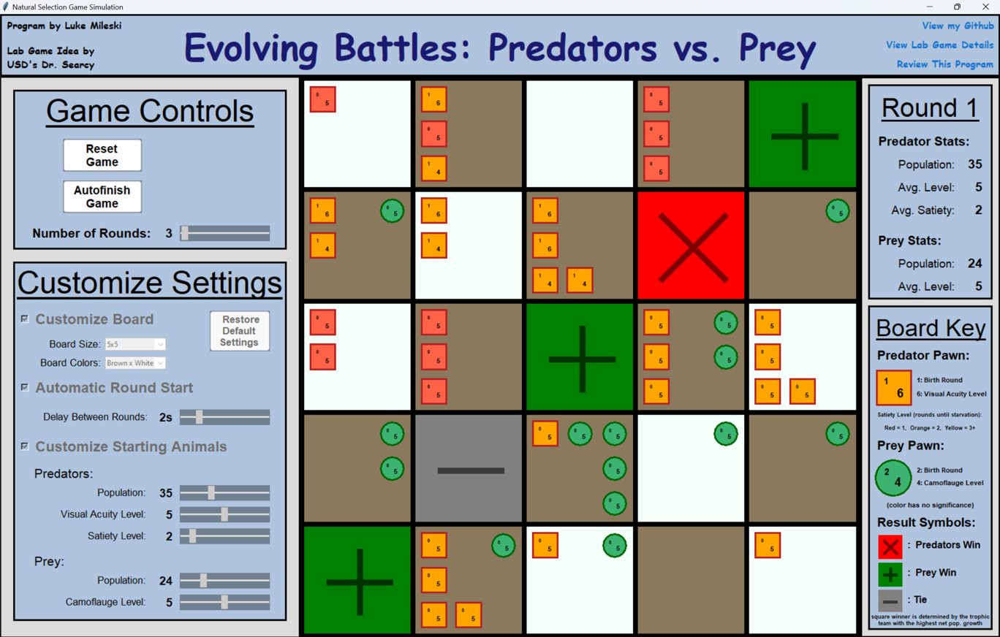

# Evolving Battles: Predators vs. Prey

## A customizable GUI board game written in Python that simulates trends in natural selection.

## Overview

This project automates University of San Diego's EOSC 123 natural selection lab. The intention of this application is to supplement the lab by allowing students to efficiently test their claims on natural selection. In addition to the substantial reduction in time constraint, this program also eliminates the likelihood of human error, allows for customizations, and automatically generates excel tables holding the completed game's data.

## Useful Links

* [rulebook](https://onedrive.live.com/edit.aspx?resid=3d8c06f048f6c577!3629)
* [installation_demo_video](https://youtu.be/bOwVrPre-oM?si=Spf6fwqrfpR1AqF1)
* [simulation_demo_video](https://youtu.be/3AdRpmGF3ns?si=M4Y0PAbKl4fT4gmG)
* [leave_a_review](https://docs.google.com/forms/d/e/1FAIpQLSduCBih2TzSOCG_rc5sQ_SZZrGLK6um6K9d3Sa8OO_rdWQ7LQ/viewform)

**Note:**
The installation video is designed for Windows computers.
If you have a Windows computer, use that. However, if you must use Mac or Linux,
extra installation steps are required due to incompatibilities. You must complete all
steps mentioned in my installation demo video then either:
1) Download Wine and use that to run the .exe file from my code provided

* Video on how to do so for Mac: https://www.youtube.com/watch?v=Bz-nI4LW2Jw&t=0s
* Video on how to do so for Linux: https://www.youtube.com/watch?v=TatVttlvo2A&t=0s

2) Or run the controller.py file from my provided code in your own terminal

* This option is less recommended
* It requires you to also install all modules used in my code.
* May be more complicated for non-coders

Also please leave a review using the above link. It helps a ton!

## GUI Layout

* A Title panel with game credits and links to my github, the game details, and a review of this program
* A Board Grid panel displaying the current predator/prey pawns and all changes between rounds
* A Game Controls panel with the following widgets:
    * Start/Reset Game button
    * Start/Finish Round button
    * Autofinish Game button
    * Export Results button (opens an excel file preloaded with the last completed game's data)
    * Number of Rounds scale
* A Customize Settings panel with the following widgets:
    * Customize Board checkbutton (for configuring the board size and colors)
    * Automatic Round Start checkbutton (conducts game without the need for user interaction)
    * Customize Starting Animals checkbutton (for configuring the inital predator/prey pawn populations, skill levels, and satiety levels)
    * Restore Default Settings button (unchecks all checkbuttons and removes user's settings changes)
* A Scoreboard panel holding the current round and predator/prey pawn stats (population, skill level, and sateity level)
* A Board Key panel describing the predator/prey pawn visuals and result symbols

## Code Synopsis

The natural selection simulation is built fully in python and utilizes the tkinter library for the GUI. I organized the code using the MVC architecture by creating separate files for the model, view, and controller. Supplementary functions related to the model such as file writing, recording data, and game logic were placed is model_helpers.py. All files testing the functions/methods in either model.py or model_helpers.py can be found in the tester_files folder. All data required for the completion of the lab is recorded throughout the game in various .csv files found under the game_results_logs folder. The default and user-configured settings to be modified throughout the game are stored as .json files under the game_settings_logs. Lastly, either start_program_here.exe or controller.py can be run to start the simulation, but only from their relevant placement within the folder.

## Rundown of File/Folder Contents

### model.py

**CurrentSettings class**

* Initialized with attributes of all settings found in the default_configurations.json file
* The CurrentSettings instance then updates its configuration attributes whenever the user makes a modification via the settings panel
* Dumps its configured settings attributes to the user_configurations.json file at the start of the match
* The CurrentSettings instance is passed to the model, view, and controller in the main guard

**Model class heirarchy**

* Each item in the below heirarchy is a class of model.py
* The BoardModel holds a 2d array of SquareModel objects (board_length x board_length)
* Each SquareModel object creates/modifies/deletes instances of PredatorModel and PreyModel depending of game outcomes
* The Animal class inherits from the ABC class and holds the template for PredatorModel and PreyModel initialization

- BoardModel
    - SquareModel (# objects = # board squares)
        - PredatorModel(Animal) (# objects = # surviving predators in square)
        - PreyModel(Animal) (# objects = # surviving prey in square)

**BoardModel class**

* Calculates various data required for the lab via all its methods starting with calculate_
* Its modify_board_survivors() function is the primary call for updating round results -
* Each SquareModel instance tracks changes to births/deaths/surviving PreyModel and PredatorModel objects via the primary call to its determine_survivors() method

### view.py

* The GUI was fully built with the tkinter library (tk)

**View class frame heirarchy:**

* Each item in the below heirarchy is a class of view.py
* The View instance is an argument to the construction of all its immediate subclasses, and those subclasses are an argument to their immediate subclasses ...
* All Frame/Canvas objects are initialized to be inside their respective parent class

- View(tk.Tk)
    - BoardView(tk.Frame)
        - SquareView(tk.Frame) (# of Tile objects = board dimensions)
            - PredatorView(tk.Frame) (# of Predator objects in the tile)
            - PreyView(tk.Canvas) (# of Prey objects in the tile)
    - Title(tk.Frame)
    - LeftMenu(tk.Frame)
        - GameControls(tk.Frame)
        - Configurations(tk.Frame)
    - RightMenu(tk.Frame)
        - ScoreBoard(tk.Frame)
        - BoardKey(tk.Frame)
            - PredatorView(tk.Frame)
            - PreyView(tk.Canvas)

**BoardView class:**

* The largest class in view.py because the board is the main area where changes to the GUI are displayed
* Holds a 1d, 2d, and diagonal matrix of SquareView objects
* All visuals are dependent on the current game data - a 2d array of SquareModel objects is attributed upon click of start game button
* Holds scheduled_tasks and scheduled_labels attributes if any upcoming visuals need to be cancelled when user clicks the reset game button
**Note:** settings attributes may not be initialized upon construction of any Frame/Canvas class - may be modified if user interacts with the customize settings panel

### controller.py

**Controller class**

* Integrates the model and view via its assign_models_to_views method:
    * Attributes to the view a 2d array of SquareModel objects
    * Attributes to the ScoreBoard the model's population/level data
    * Attributes to each SquareView object its respective SquareModel object

* Sets all commands via a call to the set_widget_commands method, which takes the controller object itself as an argument

**WidgetCommands class**

* Majority of commands are for updating the visuals/CurrentSettings when the user interacts with the scale/checkboxes in the customize settings panel
* The mainloop of the game comes from the ordered calls to the following methods:
1) start_game_button_command()
2) scatter_pawns()
3) start_round_button_command()
4) finish_round_button_command() (returns to 2 after call)

* If the user turns on the automatic round start via the customize settings panel, the mainloop operates automatically after the start game button is pressed
* Automatic mainloop was implemented with numerous view.after() calls to schedule events
* All events are kept track of in case the user selects the reset game button - all scheduled visuals must be cancelled
* Game data is updated and recorded throughout the mainloop

### model_helpers.py

* Holds a variety of functions related to the logic/data for the game, performing the following tasks:
    * converting a rectangular matrix to a diagonal one
    * finding the round winner
    * recording the round and game start/end data
    * exporting resultant game data to an excel file

### tester_files/

* pytest library used for all function tests

* test_determine_survivors.py checks 14 different scenarios of the model's determine_survivors() method - responsible for tracking pawn interactions/results
* test_model_classes.py checks the update_settings() and create_animals() model methods
* test_model_helpers.py checks the record_round_data() and record_start_and_end_data() functions in model_helpers.py

### game_results_logs/

* start_of_game_log.csv and end_of_game_log.csv hold the number of predator/prey pawns at any given skill level
* round_log.csv keeps track of each team's population and average skill level for each round - also records round winners
* At the end of every game, the contents of round_log.csv are transferred to last_game_round_log.csv in order for the export last results button to work - round_log.csv must always keep track of most current data

### game_settings_logs/

* Settings .json files are stored as 2-level dictionaries - first key is the general category of the setting - second key is the specific setting, associated with either a str or int value
* default_configurations.json holds the settings used upon the start of the program - contents only to be read from
* user_configurations.json tracks user settings modifications - file is rewritten with most current values in the CurrentSettings object upon click of the start game button

### exceptions.py

* Only holds 1 customized exception called SettingNotFound(Exception)
* I could have found more exceptions to customize but honestly didn't find it too necessary

### start_program_here.exe

* An executable file for running the program - created using PyInstaller

## Design and Reflection

I took a lot of design inspiration from projects in my COMP120 class from my 2nd semester of my freshman year. Specifically, I was able to emulate the MVC architecture, .json file structure, and pytest files found in our Wordle and Blocky applications (credits to USD's Dr. Garcia). However, much of the project I had to solve/design independently, like how to use the Pandas library for writing to excel files and how to structure the heirarchies of the view and model.

I found myself spending excessive time refactoring code because I didn't fully grasp how the MVC architecture worked. I plan to avoid this problem in future projects by initially spending more time planning the stucture and functions of my code. For me, fully understanding how the controller is able to integrate data from the model with the view and run the application was the biggest hurdle. I believe that by completing this application, I was able to gain a comprehensive understanding of how the MCV architecture works from a high- and low-level perspective.